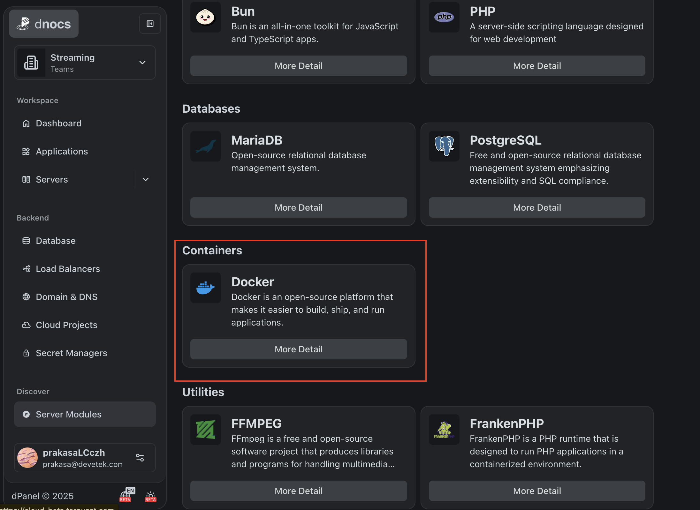
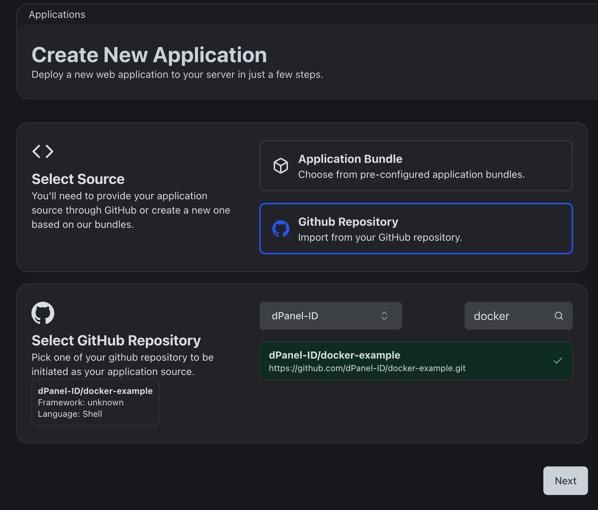
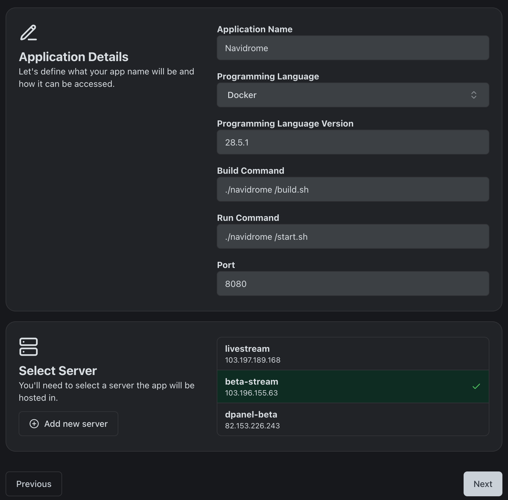
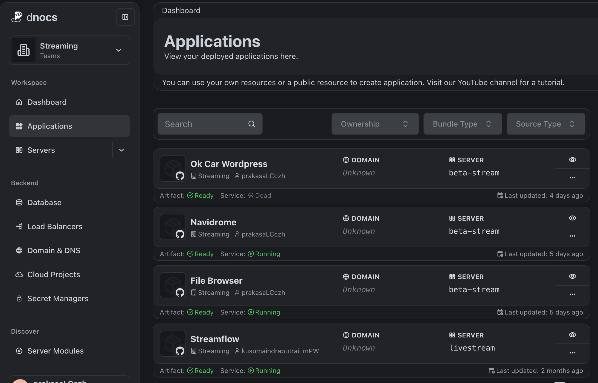
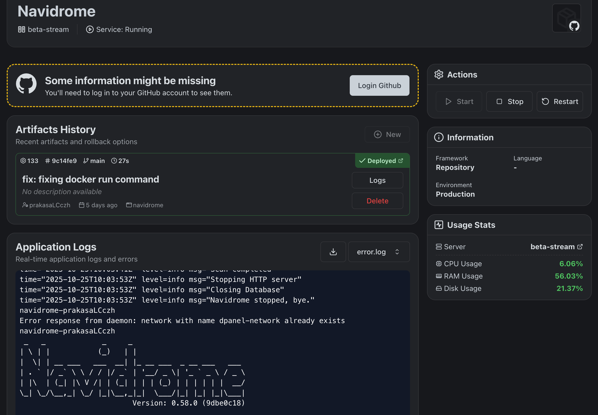
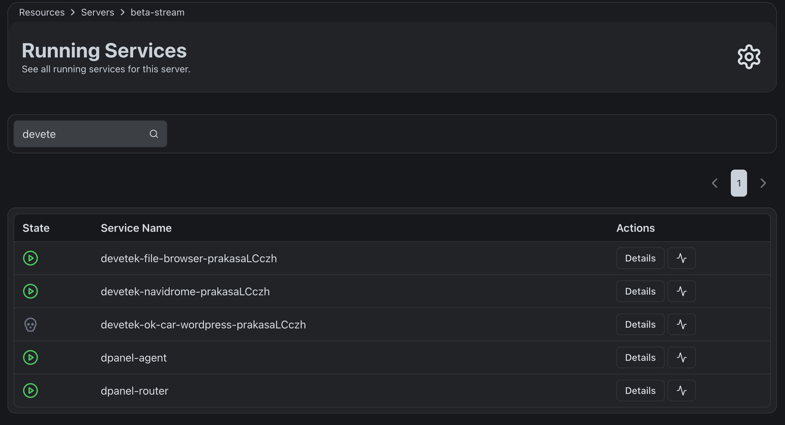

## Docker Example

Docker example is a repository that help you to manage docker container easily through systemd from dPanel. Basicaly what we do is create a systemd service file for each docker container that we want to manage. The idea is inspiring by docker compose.

We know what docker compose is just a tool to help you to manage multiple Docker containers at once in single file. We can do the same thing with systemd. But in my humble opinion, more flexible. We don't have bloated containers in single file. The idea is, we can manage each container independently per repository per systemd service. And each container will still can communicate with each other through docker network.

## Prerequisites

1. Create dPanel account
2. Install dPanel module for Docker to your server

3. Register your git repository to dPanel

4. Fill the repository information

5. Check and manage your applications

6. Manage docker service running inside systemd

Trust me!, you container can communicate with others container deploy from other repository and also with the host with alias `host.docker.internal`. Just make sure you use the same docker network.
